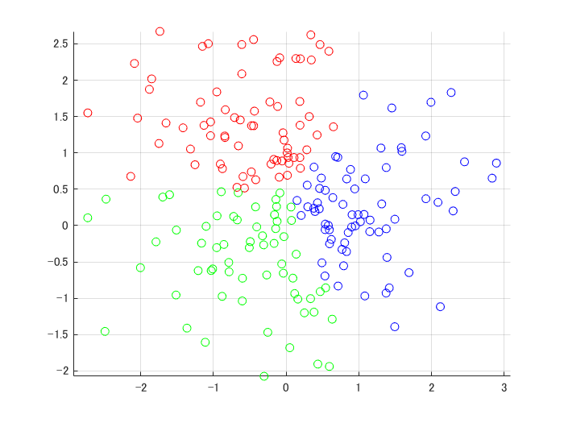
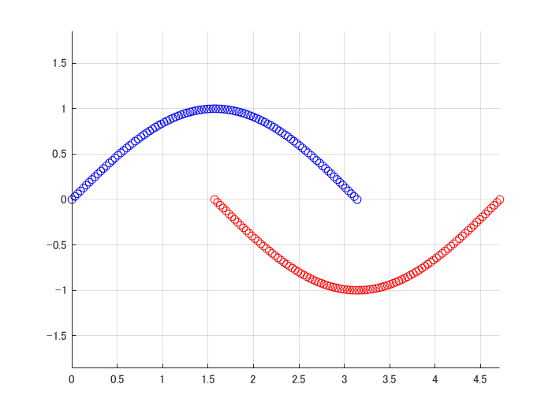

# Kernel kmeans with linear kernel is equivalent to kmeans
```matlab
close all; clear;
d = 2;
k = 3;
n = 200;
[X, y] = kmeansRnd(d,k,n);
init = ceil(k*rand(1,n));
K = knLin(X,X);
label = knKmeans(K,init);

label0 = kmeans(X,init);
maxdiff(label,label0)
```
```
ans = 0
```
```matlab
plotClass(X,label);
```



# Kernel kmeans with Gaussian Kernel for nonlinear data
```matlab
x1 = linspace(0,pi,n/2);
x2 = sin(x1);
X = [x1,x1+pi/2;
    x2,-x2];

K = knGauss(X,X,0.4);
label = knKmeans(K,2);
figure;
plotClass(X,label);
```



