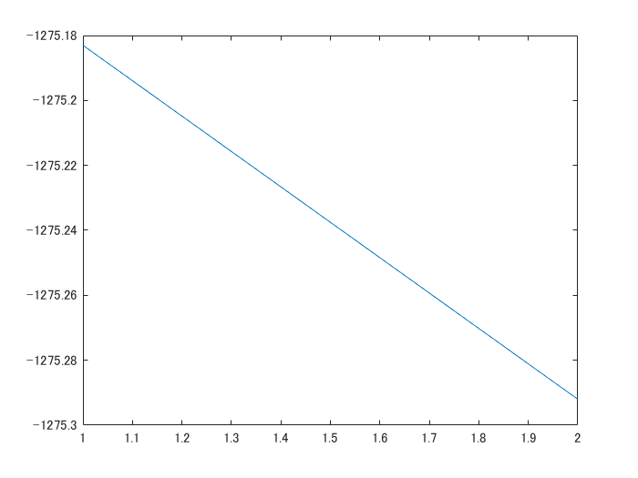
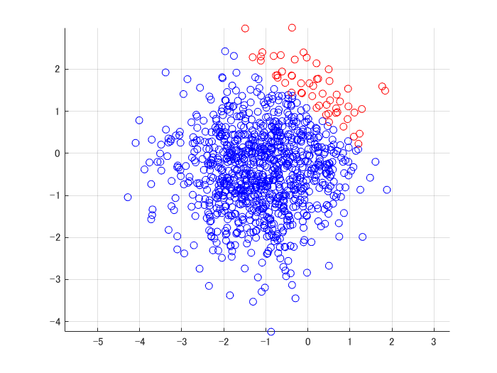

# RVM for classification
```matlab
clear; close all
k = 2;
d = 2;
n = 1000;
[X,t] = kmeansRnd(d,k,n);

[model, llh] = rvmBinEm(X,t-1);
plot(llh);
```



```matlab
y = rvmBinPred(model,X)+1;
figure;
plotClass(X,y);
```



