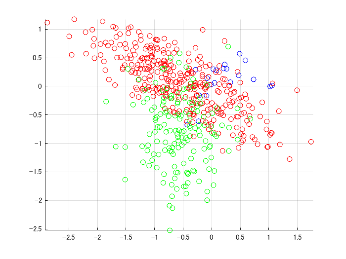
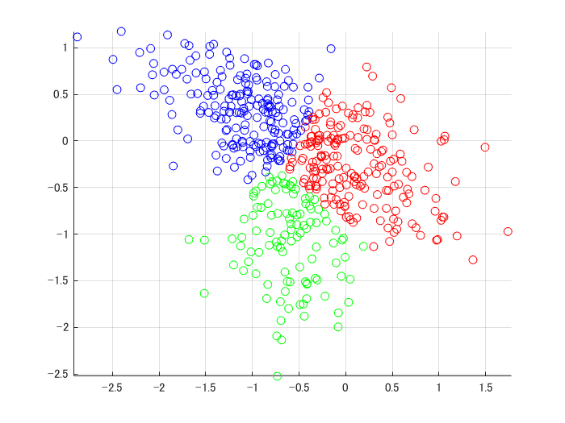
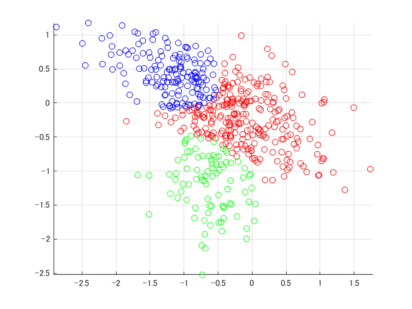
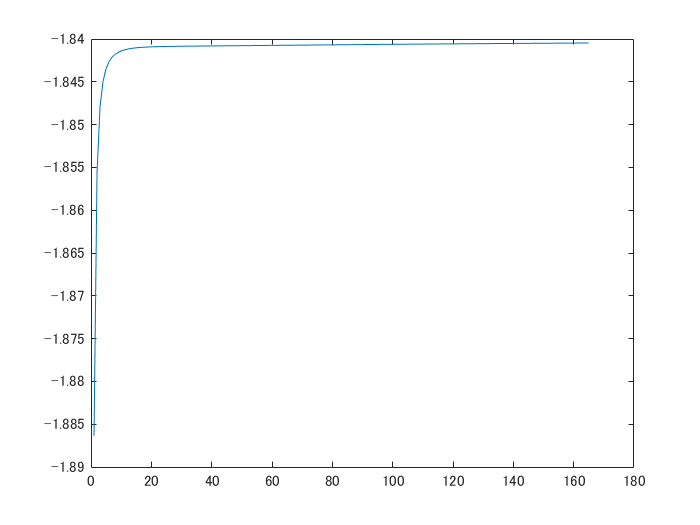

# Gauss mixture initialized by kmeans
```matlab
close all; clear;
d = 2;
k = 3;
n = 500;
[X,label] = mixGaussRnd(d,k,n);
init = kmeans(X,k);
[z,model,llh] = mixGaussEm(X,init);
```
```
EM for Gaussian mixture: running ... 
```
```matlab
plotClass(X,label);
```



```matlab
figure;
plotClass(X,init);
```



```matlab
figure;
plotClass(X,z);
```



```matlab
figure;
plot(llh);
```



