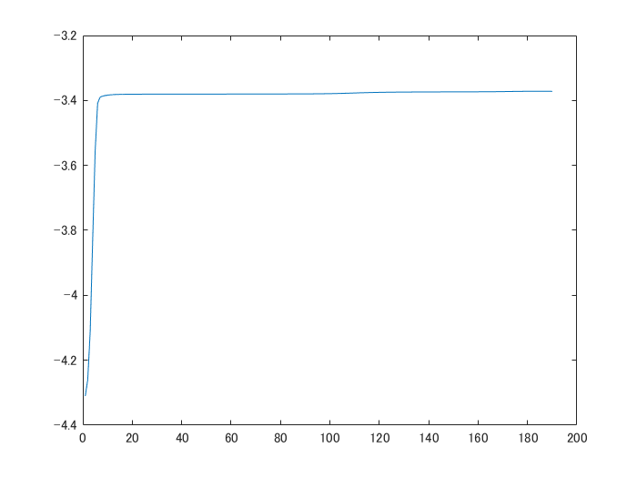

# Gausssian Mixture via EM
```matlab
close all; clear;
d = 2;
k = 3;
n = 1000;
[X,label] = mixGaussRnd(d,k,n);
plotClass(X,label);
```


```matlab

m = floor(n/2);
X1 = X(:,1:m);
X2 = X(:,(m+1):end);
% train
[z1,model,llh] = mixGaussEm(X1,k);
```
```
EM for Gaussian mixture: running ... 
```
```matlab
figure;
plot(llh);
```



```matlab
figure;
plotClass(X1,z1);
```


```matlab
% predict
z2 = mixGaussPred(model,X2);
figure;
plotClass(X2,z2);
```


