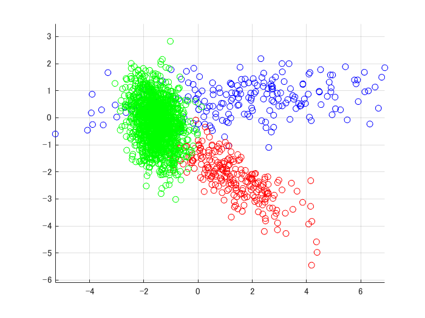

# Variational Bayesian for Gaussian Mixture Model
```matlab
close all; clear;
d = 2;
k = 3;
n = 2000;
[X,z] = mixGaussRnd(d,k,n);
plotClass(X,z);
```



```matlab
m = floor(n/2);
X1 = X(:,1:m);
X2 = X(:,(m+1):end);
% VB fitting
[y1, model, L] = mixGaussVb(X1,10);
```
```
Variational Bayesian Gaussian mixture: running ... 
```
```matlab
figure;
plotClass(X1,y1);
```


```matlab
figure;
plot(L)
```


```matlab
% Model Evidence
prior.alpha = 1;
prior.kappa = 1;
prior.m = mean(X1,2);
prior.v = d+1;
prior.M = eye(d);   % M = inv(W)
L0 = mixGaussEvidence(X1, model, prior);
L0-L(end)
```
```
ans = -3.1832e-12
```
```matlab
% Predict testing data
[y2, R] = mixGaussVbPred(model,X2);
figure;
plotClass(X2,y2);
```


