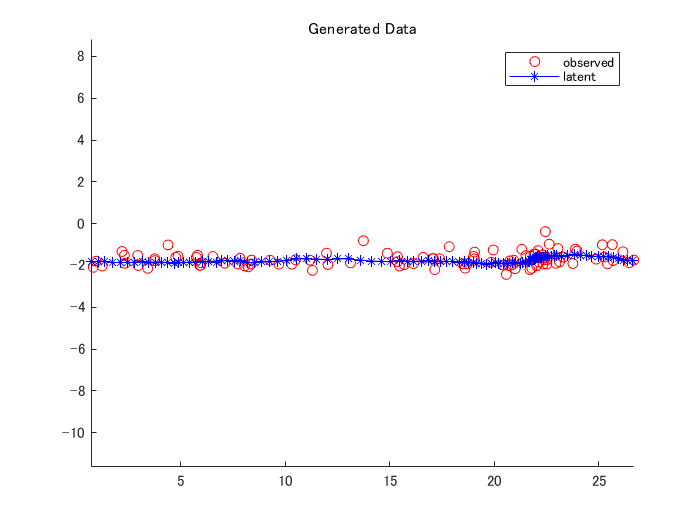
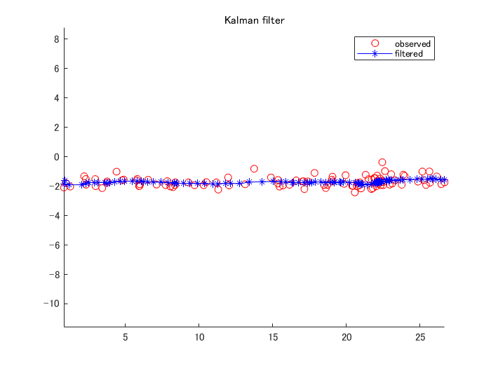
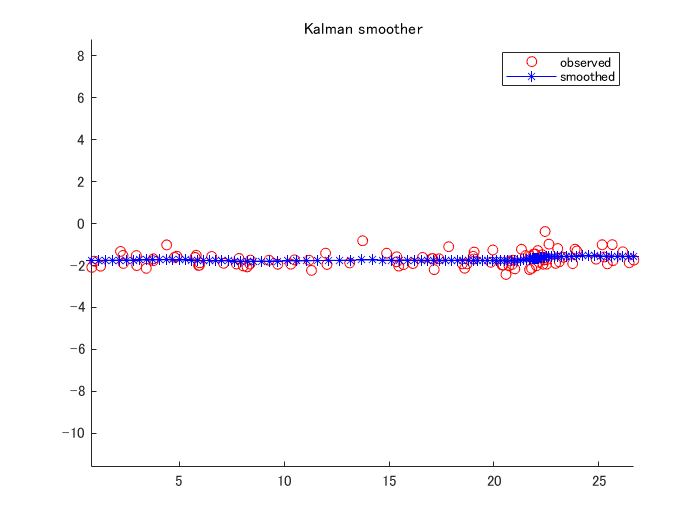
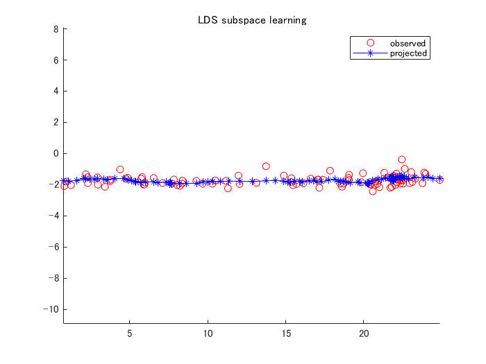
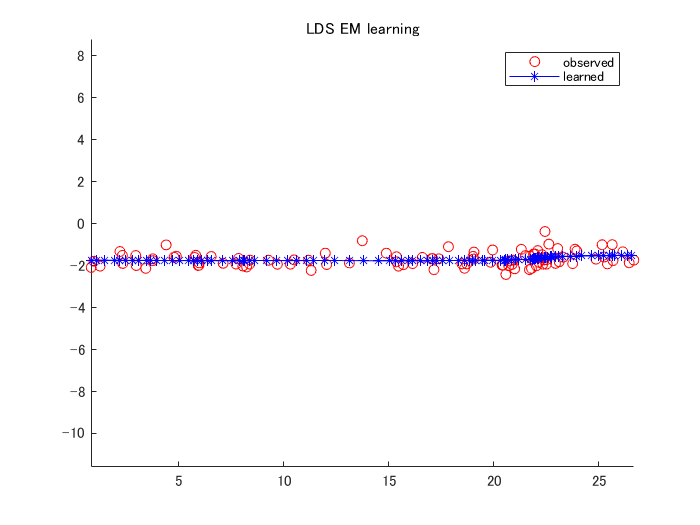
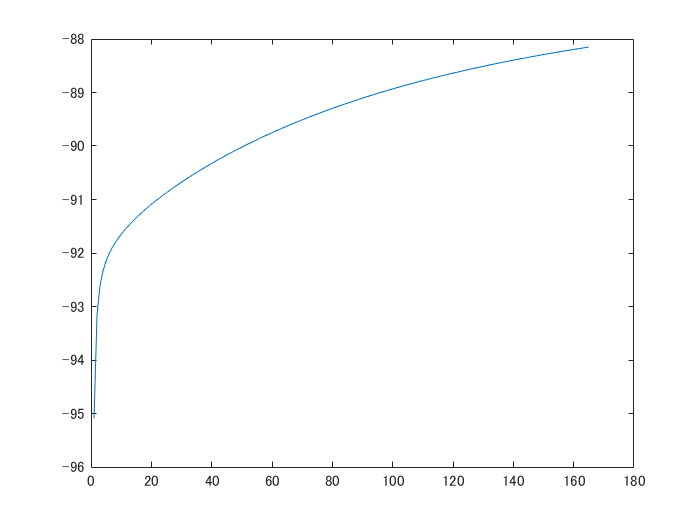

```matlab
close all;
% Parameter
clear; 
d = 2;
k = 3;
n = 100;

A = [1,0,1; 
     0 1,0;
     0,0,1];
G = eye(k)*1e-3;
 
C = [1,0,0;
     0 1,0];
S = eye(d)*1e-1;

mu0 = [0;0;0];
P0 = eye(k);

model.A = A;
model.G = G;
model.C = C;
model.S = S;
model.mu0 = mu0;
model.P0 = P0;
```
# Generate data
```matlab
[z,x] = ldsRnd(model,n);
figure;
hold on
plot(x(1,:), x(2,:), 'ro');
plot(z(1,:), z(2,:), 'b*-');
legend('observed', 'latent')
title('Generated Data')
axis equal
hold off
```



# Kalman filter
```matlab
[mu, V, llh] = kalmanFilter(model,x);
figure
hold on
plot(x(1,:), x(2,:), 'ro');
plot(mu(1,:), mu(2,:), 'b*-');
legend('observed', 'filtered')
title('Kalman filter')
axis equal
hold off
```



# Kalman smoother
```matlab
[nu, U, llh] = kalmanSmoother(model,x);
figure
hold on
plot(x(1,:), x(2,:), 'ro');
plot(nu(1,:), nu(2,:), 'b*-');
legend('observed', 'smoothed')
title('Kalman smoother')
axis equal
hold off
```



# LDS Subspace
```matlab
[A,C,nu] = ldsPca(x,k,3*k);
y = C*nu;
t = size(y,2);
figure;
hold on
plot(x(1,1:t), x(2,1:t), 'ro');
plot(y(1,1:t), y(2,1:t), 'b*-');
legend('observed', 'projected')
title('LDS subspace learning')
axis equal
hold off
```



# LDS EM
```matlab
[tmodel, llh] = ldsEm(x,k);
nu = kalmanSmoother(tmodel,x);
y = tmodel.C*nu;
figure
hold on
plot(x(1,:), x(2,:), 'ro');
plot(y(1,:), y(2,:), 'b*-');
legend('observed', 'learned')
title('LDS EM learning')
axis equal
hold off
```



```matlab
figure;
plot(llh);
```



