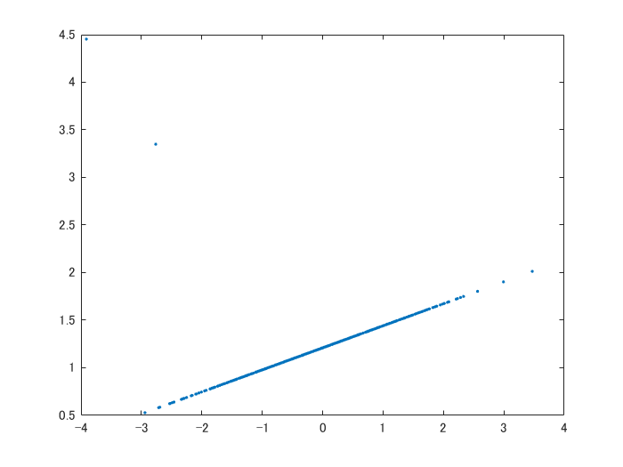
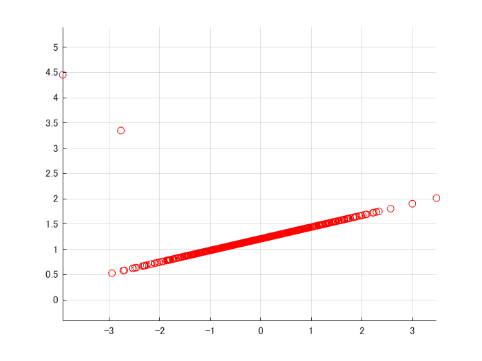
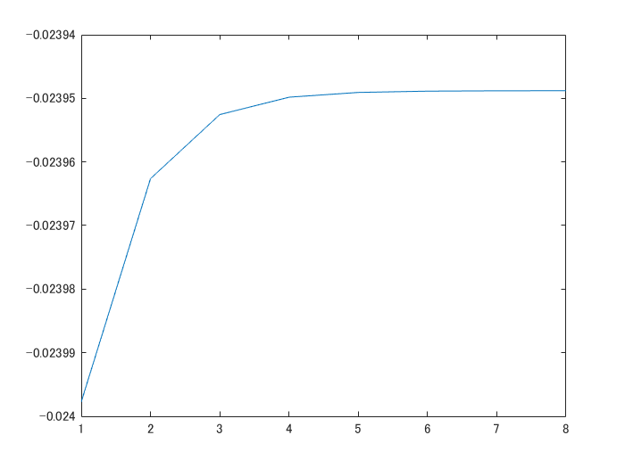

# Mixture of linear regression
```matlab
close all; clear
d = 1;
k = 2;
n = 500;
[X,y] = mixLinRnd(d,k,n);
plot(X,y,'.');
```



```matlab
[label,model,llh] = mixLinReg(X, y, k);
plotClass([X;y],label);
```



```matlab
figure
plot(llh);
```



```matlab
[y_,z,p] = mixLinPred(model,X,y);
figure;
plotClass([X;y],label);
```


